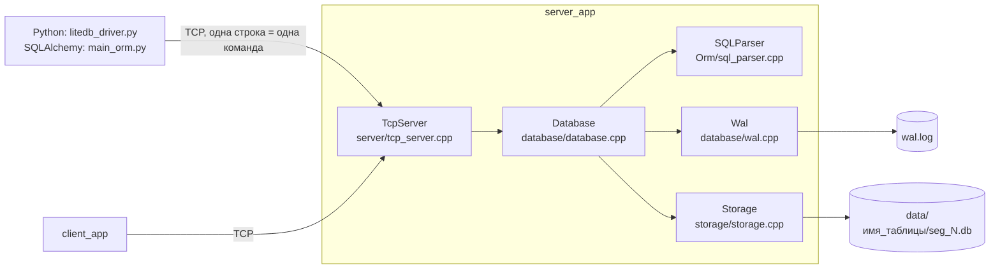

# lite_db

Учебная клиент-серверная СУБД на C++17: собственный блочный формат хранения с колоночной раскладкой и сжатием zlib, журнал предзаписи с восстановлением после сбоя, многопоточный TCP-сервер, подмножество SQL и драйвер Python DB-API 2.0.

[](https://github.com/ivanchez234/lite_db/actions/workflows/ci.yml)

Проект начинался как курсовая по САОД (структуры и алгоритмы обработки данных) и вырос в попытку разобраться, как база данных устроена изнутри. Это не production-СУБД: ниже честно перечислено, что работает, чего нет и какие ошибки известны.

## Содержание

- [Статус и ограничения](#статус-и-ограничения)
- [Быстрый старт](#быстрый-старт)
- [Архитектура](#архитектура)
- [Формат хранения](#формат-хранения)
- [Надёжность: журнал предзаписи](#надёжность-журнал-предзаписи)
- [Многопоточность](#многопоточность)
- [Протокол и команды](#протокол-и-команды)
- [Python: драйвер и SQLAlchemy](#python-драйвер-и-sqlalchemy)
- [Сборка](#сборка)
- [Тесты и проверки](#тесты-и-проверки)
- [Решения и почему](#решения-и-почему)
- [Сознательно не реализовано](#сознательно-не-реализовано)
- [Производительность](#производительность)
- [Что я узнал](#что-я-узнал)
- [Планы](#планы)

## Статус и ограничения

**Работает и покрыто тестами**

- Таблицы со схемой из типов `STRING`, `INT`, `DOUBLE`, `BOOL`, `DATE` и целочисленным ключом `id`.
- Вставка, частичное обновление (как `UPDATE` в SQL), удаление и чтение записи по `id`, чтение одного поля, чтение всей таблицы.
- Строгая проверка по схеме: типы, набор колонок, реальные даты. Строки могут содержать любые символы, кроме перевода строки: запятые, кавычки и скобки сохраняются как есть.
- Хранение на диске: сжатые блоки в сегментах, индекс по `id` восстанавливается при перезапуске.
- Журнал предзаписи: после аварийного завершения процесса (`kill -9`) всё, на что клиент получил `OK`, восстанавливается.
- Многопоточный сервер: клиенты работают параллельно, ответы каждому клиенту приходят в порядке его запросов, остановка по Ctrl+C корректно сбрасывает данные.
- Пакетная вставка `MPUT`: атомарная, одна запись журнала и один fsync на пакет. Групповой коммит журнала, кеш распакованных блоков.
- Счётчики сервера (`STATS`), нагрузочный клиент и замеры с описанной методикой: см. [Производительность](#производительность).
- Linux (GCC, Clang) и Windows (MSYS2 UCRT64, GCC). Обе платформы собираются и тестируются в CI.

**Ограничения, о которых надо знать**

- **Нет транзакций.** Каждая команда фиксируется сама по себе. Сгруппировать несколько команд и откатить их нельзя.
- **Поиск только по `id`.** Нет запросов по диапазону и вторичных индексов.
- **SQL — только подмножество.** Условие `WHERE` — только `id = число`. Список колонок в `SELECT` не учитывается: возвращается вся запись. `NULL` не поддерживается. Всё, чего транслятор не понимает, отвергается с ошибкой `ERR_SQL_PARSER`, а не выполняется приблизительно.
- **Индекс всех ключей живёт в памяти** и при старте строится заново чтением всех сегментов, поэтому время запуска растёт вместе с данными.
- **Нет компакции.** Обновления и удаления дописываются в конец, старые версии остаются на диске.
- **Записи в одну таблицу подтверждаются по одной.** В режиме `wal_sync: full` запись ждёт fsync журнала, держа замок таблицы. Так изменение становится видно другим только после того, как оно на диске. Групповой коммит объединяет fsync записей в разные таблицы, но не в одну. Для массовой записи есть `MPUT` (подробнее в [Производительность](#производительность)).
- **В формате блока нет номера версии и собственной контрольной суммы.** Целостность проверяют только встроенная в zlib контрольная сумма Adler-32 и проверки границ при чтении. Поля записи опознаются по 32-битному хешу имени, коллизии хешей не проверяются. Битами упаковывается только первая `BOOL`-колонка таблицы. Формат рассчитан на little-endian.
- **Нет аутентификации и шифрования.** Поэтому по умолчанию сервер слушает только `127.0.0.1`. Открыть его в сеть можно только явно (`server_app 5555 0.0.0.0`), и делать это стоит лишь там, где к нему не подключатся посторонние.

**Исправленные ошибки.** Раньше запятая внутри строки обрезала значение (`"Smith, John"` → `"Smith"`), `WHERE` по колонке, кроме `id`, молча возвращал всю таблицу, `INSERT` без `id` сохранял запись с `id = -1`, а SQL-запрос длиной в несколько килобайт мог уронить сервер. Теперь на каждый из этих случаев есть регрессионный тест.

## Быстрый старт

Нужны CMake ≥ 3.14, компилятор C++17, zlib и git (тестовый фреймворк скачивается при сборке). Python 3 нужен только для драйвера, сквозного теста и скрипта замеров.

```bash
git clone https://github.com/ivanchez234/lite_db.git
cd lite_db
cmake -S . -B build
cmake --build build -j
```

Сервер берёт таблицы из `setup.yaml` в текущем каталоге и хранит данные там же (`data/`, `wal.log`):

```bash
./build/server_app          # 127.0.0.1:5555; другой порт и адрес: ./build/server_app 6000 0.0.0.0
./build/client_app          # консольный клиент: команда — ответ
```

Сеанс в `client_app` (ответы сервера настоящие):

```text
> INSERT use 1 {"name": "Ivan", "age": 21, "is_active": true}
OK
> INSERT INTO use (id, name, age, is_active) VALUES (2, 'Maria', 22, 0)
OK
> SELECT use 1
{"name":"Ivan","age":21,"is_active":true}
> SELECT use 1 name
Ivan
> SELECT * FROM use WHERE id = 2
{"name":"Maria","age":22,"is_active":false}
> INSERT use 1 {"name": "Copy", "age": 1, "is_active": true}
ERR_ID_EXISTS
> INSERT use 3 {"name": "Bob", "age": "old", "is_active": true}
ERR_CONSTRAINT_VIOLATION
> UPDATE use 2 {"name": "Maria", "age": 23, "is_active": true}
OK
> SELECT use ALL
[{ "id": 1, "data": {"name":"Ivan","age":21,"is_active":true} }, { "id": 2, "data": {"name":"Maria","age":23,"is_active":true} }]
> DELETE FROM use WHERE id = 1
OK
> SELECT use 1
ERR_NOT_FOUND
> FLUSH
OK: All buffers flushed to disk
```

Ctrl+C останавливает сервер: он дожидается всех потоков, сбрасывает буферы на диск и очищает журнал.

## Архитектура



| Компонент | Где в коде | Что делает |
|---|---|---|
| TcpServer | `server/tcp_server.*`, `server/socket_handle.h` | Принимает соединения, режет поток байтов на команды, раздаёт их рабочим потокам |
| Остановка | `server/shutdown.*` | Ctrl+C / SIGTERM / закрытие консоли Windows → корректная остановка |
| Database | `database/database.*` | Выполняет команды, связывает журнал и хранилище, делает контрольную точку (`FLUSH`) |
| SQLParser | `Orm/sql_parser.*` | Переводит подмножество SQL во внутренние команды (на `std::regex`) |
| Wal | `database/wal.*` | Журнал предзаписи: запись, fsync, чтение при восстановлении |
| Storage | `storage/storage.*`, `storage/byte_reader.h`, `storage/file_sync.*` | Формат записей и блоков, сжатие, индекс, сброс на диск |

**Путь записи** (`INSERT use 5 {...}`):

1. Команда переводится во внутренний формат, Database берёт разделяемый замок контрольной точки.
2. Storage берёт эксклюзивный замок таблицы и проверяет, что `id` свободен.
3. Значения проверяются по схеме и упаковываются в бинарную запись.
4. Команда пишется в журнал (и, в режиме `full`, проходит через fsync).
5. Запись попадает в буфер таблицы. Когда в буфере набирается 4 КБ, он перепаковывается в колонки, сжимается zlib и дописывается в конец сегмента, а индекс получает адрес блока.
6. Только после этого клиент получает `OK`.

**Путь чтения** (`SELECT use 5`):

1. Storage берёт разделяемый замок таблицы, поэтому читатели одной таблицы работают параллельно.
2. Сначала просматривается буфер, там лежат самые свежие версии.
3. Если в буфере записи нет, индекс даёт адрес блока на диске. Блок читается, распаковывается zlib, колонки собираются обратно в строки, и берётся последняя версия записи с этим `id`.
4. JSON ответа собирается по схеме таблицы.

## Формат хранения

```text
data/<таблица>/_schema.bin   схема: число колонок, затем (длина имени, имя, тип)
data/<таблица>/seg_N.db      сегменты до 10 МБ; блоки только дописываются в конец

Блок на диске
  u32 original_size, u32 compressed_size     заголовок
  zlib( колоночная раскладка )

Колоночная раскладка блока (до сжатия)
  u32 count
  u32 sizes[count]           длины записей
  i32 id_deltas[count]       id, закодированные разностями
  u8  has_bool
  [u32 size, биты]           первая BOOL-колонка: 1 бит на запись
  записи подряд              уже без вынесенного BOOL-значения

Запись
  u32 magic, u32 total_size, u32 keys_count
  keys_count × { u32 hash(имя поля), u32 offset, u32 size }
  значения полей подряд, текстом
  Удаление — «надгробие»: запись из одного id, без тела.
```

Одно поле читается без разбора записи целиком: по хешу имени находится смещение значения. Все длины и смещения, прочитанные из файла, проверяются до использования (`ByteReader`), а размеры блока ограничены сверху. Поэтому обрезанный или испорченный файл даёт ошибку чтения, а не выход за границы буфера. На это есть отдельные тесты.

## Надёжность: журнал предзаписи

Запись журнала: `[u32 crc32][u32 длина][текст команды]`. Контрольная сумма нужна прежде всего, чтобы отличить оборванную при аварии последнюю запись от целой. При восстановлении журнал читается до первой битой записи, всё, что после неё, отбрасывается.

| `wal_sync` в `setup.yaml` | Что делается на каждой записи | Что переживает |
|---|---|---|
| `none` | только буфер процесса | ничего: даже падение процесса теряет данные |
| `flush` | данные отдаются ядру | падение процесса, но не потерю питания |
| `full` (по умолчанию) | fsync / `FlushFileBuffers` | и потерю питания |

Правила, на которых держится надёжность:

- **Журнал пишется до изменения данных.** Пока журнал не подтвердил запись, клиент не получает `OK`. Если записать журнал не удалось, клиент получает `ERR_WAL_WRITE_FAILED`, а изменение не применяется.
- **Отвергнутые команды в журнал не попадают:** проверка данных идёт до записи в журнал.
- **Ошибка журнала «залипает» до перезапуска.** После неудачного fsync ядро помечает страницы файла чистыми, и повторный fsync вернёт успех, хотя данных на диске нет (история «fsyncgate» в PostgreSQL). Поэтому после первой ошибки журнал отказывает во всех записях, а не делает вид, что сохранил их.
- **Групповой коммит.** fsync делает «лидер» — первый поток, заставший журнал без идущего fsync. Он делает его уже без мьютекса и сразу за все записи, дописанные к этому моменту, а остальные ждут результата. Один fsync подтверждает пачку записей: это видно по `wal_fsyncs` и `wal_appends` в `STATS`. Если fsync не удался, ошибку получают все, чьи записи он должен был подтвердить.
- **Журнал очищается только после настоящего сохранения данных.** `FLUSH` (и остановка сервера) сбрасывает буферы всех таблиц, делает fsync сегментов и каталогов и только после этого очищает журнал. Если что-то из этого не удалось, журнал остаётся, и данные восстановятся при следующем запуске.

Авария на практике: записали три команды, убили процесс через `kill -9`, запустили снова.

```text
[WAL] Crash detected! Found 3 uncommitted operations.
[WAL] Replaying log to restore Write Buffer...
[WAL] Successfully recovered 3 operations!
```

## Многопоточность

Потоки сервера:

- один поток принимает соединения;
- на каждое соединение заводится поток чтения (не больше 256 соединений);
- пять рабочих потоков выполняют команды.

Каждым соединением в любой момент занят ровно один рабочий поток, поэтому ответы клиенту приходят в порядке запросов, а параллелизм идёт между клиентами. Если клиент шлёт быстрее, чем сервер выполняет, сервер перестаёт читать его сокет, и TCP сам притормаживает отправителя. Команды при этом не выбрасываются.

| Замок | Тип | Защищает | Кто берёт |
|---|---|---|---|
| контрольной точки (`Database`) | `shared_mutex` | согласованность «журнал ↔ буферы» | запись — разделяемо; `FLUSH`, `CREATE`, `SCHEMA` — эксклюзивно; `SELECT` — не берёт |
| каталога (`Storage`) | `shared_mutex` | список таблиц | только на время поиска таблицы |
| таблицы (`Table`) | `shared_mutex` | буфер, индекс, схема | чтение — разделяемо, запись — эксклюзивно |
| журнала (`Wal`) | `mutex` | файл журнала | запись и очистка журнала; сам fsync идёт без мьютекса (групповой коммит) |
| кеша блоков (`BlockCache`) | 8 × `mutex` | шарды LRU | поиск и добавление блока |

Замки всегда берутся в одном порядке: контрольная точка → каталог → таблица → журнал или шард кеша. Цикла ожидания быть не может.

Остановка: ни один поток не отсоединяется (`detach`). Поток приёма и потоки чтения не засыпают в `accept`/`recv` навсегда, а раз в 200 мс (`poll`/`select` с таймаутом) проверяют флаг остановки. Сокет из другого потока не закрывается: номер дескриптора к тому моменту мог достаться другому соединению. `run()` возвращается, только когда все потоки завершены, после чего база безопасно сбрасывает данные.

## Протокол и команды

Протокол текстовый и построчный: одна команда — одна строка, один ответ — одна строка.

| Команда | Пример | Ответ |
|---|---|---|
| Создать таблицу | `CREATE users` | `OK: Table 'users' created` |
| Задать схему | `SCHEMA users name:STRING age:INT is_active:BOOL` | `OK: Schema applied` |
| Вставить | `INSERT users 1 {"name": "Ivan", "age": 21, "is_active": true}` | `OK` / `ERR_ID_EXISTS` |
| Изменить поля | `UPDATE users 1 {"age": 22}` | `OK` / `ERR_NOT_FOUND` |
| Прочитать запись | `SELECT users 1` | JSON записи / `ERR_NOT_FOUND` |
| Прочитать поле | `SELECT users 1 name` | значение поля |
| Прочитать таблицу | `SELECT users ALL` | JSON-массив `[{ "id": ..., "data": {...} }, ...]` |
| Вставить пакет | `MPUT users 1 {...} 2 {...} 3 {...}` | `OK` или ошибка, и тогда не вставлено ничего |
| Удалить | `DELETE users 1` | `OK` / `ERR_NOT_FOUND` |
| Контрольная точка | `FLUSH` | `OK: All buffers flushed to disk` |
| Счётчики | `STATS` | JSON: записи журнала и fsync, блоки, попадания в кеш |

Подмножество SQL (переводится в команды выше):

```sql
INSERT INTO users (id, name, age, is_active) VALUES (1, 'Ivan', 21, 1)
SELECT * FROM users WHERE id = 1
SELECT * FROM users
UPDATE users SET name = 'Ivan', age = 22, is_active = 1 WHERE id = 1
DELETE FROM users WHERE id = 1
```

Ограничения SQL-подмножества:

- `WHERE` — только `id = число`, с необязательным именем таблицы (`users.id = 1`).
- `LIMIT n` (n ≥ 1) и `OFFSET 0` допускаются только вместе с `WHERE id` (так пишет SQLAlchemy для `.first()`).
- `UPDATE` меняет только перечисленные колонки. `id` поменять нельзя.
- Строки — в одинарных кавычках, кавычка внутри удваивается: `'O''Brien'`.
- Запрос, который транслятор не понимает, даёт `ERR_SQL_PARSER` с объяснением.

Таблицы и их схемы можно также описать в `setup.yaml` — они создаются при старте сервера. Там же настройки:

| Ключ | По умолчанию | Что задаёт |
|---|---|---|
| `wal_sync` | `full` | надёжность журнала: `none`, `flush`, `full` (см. [журнал](#надёжность-журнал-предзаписи)) |
| `block_cache_mb` | `32` | размер кеша распакованных блоков, 0 — выключен |
| `block_size_kb` | `4` | сколько КБ записей копить перед сжатием в блок |

Сервер ищет `setup.yaml` в папке, откуда его запустили. При сборке CMake копирует его в `build/`, поэтому `server_app` можно запускать прямо оттуда.

Основные ошибки: `ERR_NOT_FOUND`, `ERR_ID_EXISTS`, `ERR_CONSTRAINT_VIOLATION` (данные не соответствуют схеме), `ERR_INVALID_JSON`, `ERR_SQL_PARSER` (запрос вне поддерживаемого подмножества), `ERR_TABLE_NOT_FOUND`, `ERR_WAL_WRITE_FAILED`, `ERR_FLUSH_FAILED`, `ERR_COMMAND_TOO_LONG` (строка длиннее 1 МБ), `ERR_TOO_MANY_CONNECTIONS`, `ERR_UNKNOWN_COMMAND`.

## Python: драйвер и SQLAlchemy

`litedb_driver.py` реализует DB-API 2.0 (PEP 249) поверх одного постоянного соединения:

```python
import litedb_driver as db

with db.connect(port=5555) as conn:
    cur = conn.cursor()
    cur.execute("INSERT INTO use (id, name, age, is_active) VALUES (?, ?, ?, ?)",
                (10, "Ivan", 21, True))
    cur.execute("SELECT * FROM use WHERE id = ?", (10,))
    print(cur.fetchone())   # ('Ivan', 21, True)
```

- Транзакций нет, поэтому `commit()` ничего не делает (каждая команда уже зафиксирована), а `rollback()` честно бросает `NotSupportedError`.
- Ответы сервера превращаются в исключения PEP 249: `IntegrityError`, `ProgrammingError`, `OperationalError` и т. д.
- Строковые параметры экранируются по правилам SQL (кавычка удваивается), поэтому значение остаётся данными и не может стать частью запроса. Отвергается только перевод строки: в протоколе это конец команды.

`main_orm.py` — пример минимального диалекта SQLAlchemy (`litedb://`) поверх драйвера. Он не входит в CI.

## Сборка

| Что | Linux | Windows |
|---|---|---|
| Окружение | GCC или Clang, `zlib1g-dev` | [MSYS2](https://www.msys2.org/), среда UCRT64: `pacman -S mingw-w64-ucrt-x86_64-{gcc,cmake,ninja,zlib,python} git` |
| Сборка | `cmake -S . -B build && cmake --build build -j` | `cmake -S . -B build -G Ninja && cmake --build build` |
| Тесты | `ctest --test-dir build --output-on-failure` | так же |

Опции CMake:

- **`CMAKE_BUILD_TYPE`.** По умолчанию `Release`. Без явного типа сборки замеры скорости измеряли бы неоптимизированную программу.
- **`LITE_DB_SANITIZER`.** Варианты: `address`, `undefined`, `address+undefined`, `thread`. Санитайзер включается для всего дерева сборки, только GCC и Clang.
- **`LITE_DB_BUILD_TESTS`.** По умолчанию `ON`.

Собираются `server_app`, `client_app`, `bench_client` (нагрузочный клиент), `bench_storage` (замер движка без сети) и `lite_db_tests`.

Пример сборки под ThreadSanitizer:

```bash
cmake -S . -B build-tsan -DCMAKE_BUILD_TYPE=Debug -DLITE_DB_SANITIZER=thread
cmake --build build-tsan -j && ctest --test-dir build-tsan --output-on-failure
```

## Тесты и проверки

63 теста на Catch2 (`tests/`):

| Файл | Что проверяет |
|---|---|
| `test_json.cpp` | Разбор JSON: экранирование, Unicode, запятые внутри строк, некорректный ввод |
| `test_sql_parser.cpp` | Перевод SQL: кавычки, `WHERE` только по `id`, `INSERT` без `id`, запрос длиной 1 МБ не роняет процесс |
| `test_storage_format.cpp` | Запись и чтение до и после сброса, переоткрытие базы, `BOOL` в битовой колонке, обрезанные и испорченные файлы |
| `test_wal.cpp` | Порядок записей, оборванная последняя запись, повреждение (CRC), режимы fsync, групповой коммит из 8 потоков |
| `test_database.cpp` | Отвергнутое не попадает в журнал, строгие типы и даты, частичный `UPDATE`, `MPUT` (атомарность, восстановление пакета, часть которого уже на диске), кеш блоков (попадания, сброс при смене схемы, параллельное чтение с вытеснением), настройки, `FLUSH` очищает журнал, модель аварии с восстановлением, сломанный журнал → ошибка клиенту, параллельные записи вместе с `FLUSH` |
| `test_concurrency.cpp` | Параллельные чтения, чтение во время записи и удаления |
| `test_server.cpp` | Порядок ответов на пачку команд, 8 клиентов параллельно, клиент закрыл отправку, остановка с подключёнными клиентами, слишком длинная строка |

Сквозной тест `tests/test_driver_e2e.py` запускает настоящий `server_app` и проверяет три вещи:

- драйвер;
- остановку по Ctrl+C: код выхода 0 и пустой журнал (только на Linux: в CI на Windows послать Ctrl+C процессу без консоли нельзя);
- восстановление после `kill`.

CI (`.github/workflows/ci.yml`) на каждый push:

- Linux: Release, ASan+UBSan, TSan;
- Windows UCRT64;
- clang-tidy (`.clang-tidy`), где любая находка считается ошибкой.

Linux здесь нужен не для галочки: ThreadSanitizer на Windows не существует, а гонки находит только он.

## Решения и почему

- **Колонки только на диске, в памяти строки.** Свежие записи копятся в буфере в строковом виде: так вставка дешёвая. При сбросе буфер перепаковывается в колонки, где хорошо работают разностное кодирование `id` и битовая упаковка `BOOL`, а zlib сжимает однородные данные лучше.
- **zlib.** Одна распространённая зависимость и хороший коэффициент сжатия. Цена — медленная распаковка, но повторные чтения её уже не платят: их обслуживает кеш распакованных блоков.
- **Замок таблицы держится до fsync.** Изменение становится видно другим только после того, как оно на диске: никто не прочитает данные, которые пропадут при сбое питания. Цена — записи в одну таблицу не объединяются в групповой коммит, а читатели этой таблицы ждут fsync пишущего.
- **Журнал пишется под замком таблицы.** Проверка «`id` свободен», запись в журнал и применение идут под одним замком. Поэтому два `INSERT` с одинаковым `id` не могут оба пройти, а порядок записей в журнале совпадает с порядком применения.
- **Разделяемый замок контрольной точки вместо одного мьютекса на всю базу.** Раньше общий мьютекс сериализовал все команды, и пул из пяти потоков работал фактически как один поток. Теперь записи в разные таблицы не ждут друг друга, чтения этот замок не берут вовсе (их от записей в ту же таблицу отделяет только замок таблицы), и только `FLUSH` получает момент, когда ни одна запись не находится между журналом и буфером.
- **Поток на соединение и общий пул исполнителей.** Чтение сокета блокирующее и простое, а выполнение команд ограничено пятью потоками независимо от числа клиентов. Асинхронный ввод-вывод (`epoll`, IOCP) при таких масштабах дал бы сложность без выигрыша.
- **Регулярные выражения не видят пользовательских данных.** Реализация `std::regex` в libstdc++ рекурсивна, и глубина стека растёт с длиной строки. SQL-запрос в несколько килобайт (при стеке потока в 1 МБ, как на Windows) переполнял стек и ронял весь сервер. Поэтому структура запроса — ключевые слова, скобки, списки, строки в кавычках — разбирается ручным проходом за линейное время, а регулярные выражения проверяют только короткие фрагменты вроде `id = 5`, и длина каждого ограничена.
- **Шардировать индекс не стал.** Узкое место при записи — буфер таблицы, который всё равно защищён замком таблицы. Шардирование одного индекса без переделки буфера ничего бы не дало, а без замеров это гадание.

## Сознательно не реализовано

- **Транзакции из нескольких команд и MVCC.** Нужны журнал с границами транзакций, откат и видимость версий. Это отдельный большой проект, а честное «каждая команда — своя транзакция» лучше, чем видимость поддержки.
- **B-дерево и запросы по диапазону.** Хеш-индекс в памяти даёт поиск по ключу за O(1). Для диапазонов в планах разреженный индекс по сегментам.
- **Оптимизации, которые не окупились бы.** Об этом подробно, с цифрами, в [Производительность](#производительность).
- **Аутентификация и TLS.** Вне учебной задачи. Отсюда предупреждение не открывать сервер в сеть.

## Производительность

Все числа ниже сняты одним способом, и их можно повторить:

```bash
cmake -S . -B build && cmake --build build -j
python benchmarks/run.py --build build   # сетевые сценарии, 3 повтора, медиана
build/bench_storage                       # движок без сети: размер блока
```

`benchmarks/run.py` для каждого сценария делает следующее:

1. Поднимает `server_app` в чистой папке.
2. Гоняет нагрузочный клиент `bench_client`. Он написан на C++, чтобы клиент сам не стал узким местом; у каждого клиента свой поток и своё соединение, задержка меряется на каждом запросе.
3. Снимает счётчики сервера командой `STATS`.
4. Останавливает сервер.

Сырые результаты лежат в `benchmarks/results/`. Скрипт печатает тип сборки и предупреждает, если это не Release: отладочная сборка медленнее в разы, и такие цифры ничего не говорят.

**Условия.** Облачная виртуальная машина: 2 vCPU Intel Xeon 2,8 ГГц, 7 ГБ памяти, Linux 6.18, ext4 на виртуальном диске (fsync ≈ 0,3 мс). GCC 13.3, сборка Release. Клиент и сервер на одной машине, соединение через loopback. В таблице до 100 тыс. записей по ~50 байт. Те же сценарии повторены на ноутбуке с Windows — см. [ниже](#те-же-сценарии-на-windows).

На другом железе абсолютные числа будут другими, особенно всё, что упирается в fsync. Показательно соотношение «до/после». Разброс между повторами доходит до 10–15%, поэтому изменением считается только то, что выходит за его пределы.

### Что изменили и что это дало

| Изменение | Сценарий | Было | Стало | Почему |
|---|---|---:|---:|---|
| `TCP_NODELAY` | чтение, 1 клиент, конвейер по 16 команд | 363 запр/с, p50 44 мс | 37 037 запр/с, p50 0,4 мс | Алгоритм Нейгла не отправлял следующий маленький ответ, пока клиент не подтвердит предыдущий, а клиент откладывал подтверждение (delayed ACK) примерно на 40 мс |
| Пакетная вставка `MPUT` | вставка, 1 клиент, `full` | 2 017 строк/с (по одной) | 59 546 строк/с (по 100) | Одна запись журнала и один fsync на 100 строк |
| Кеш распакованных блоков | чтение с диска, 4 клиента | 16 958 строк/с, p50 201 мкс | 24 810 строк/с, p50 130 мкс | Повторное чтение блока не открывает файл и не распаковывает zlib |
| Групповой коммит журнала | вставка, 4 клиента в 4 таблицы, `full` | 2 725 строк/с | 4 037 строк/с | Один fsync подтверждает в среднем две записи (`wal_fsyncs / wal_appends` = 0,5) |
| — | вставка, 4 клиента в одну таблицу, `full` | 2 648 строк/с | 2 692 строк/с | Без изменений, см. ниже |

**Почему записи в одну таблицу не ускорились.** Запись держит замок таблицы, пока её запись в журнале не пройдёт fsync: так изменение становится видно только после того, как оно на диске. Поэтому записи в одну таблицу выстраиваются в очередь ещё до журнала, и объединять в группу нечего. Читатели этой таблицы при этом тоже ждут fsync пишущего. Ослабить это можно двумя способами: делать изменение видимым до fsync или применять записи в порядке номеров журнала без замка таблицы. Оба меняют гарантии, поэтому оставлены на потом. Для массовой записи в одну таблицу есть `MPUT`.

Режим `wal_sync: none` показывает, сколько стоит всё, кроме fsync: около 0,1 мс на вставку против 0,4–0,45 мс в режиме `full`. Значит, 3/4 времени вставки — ожидание диска.

### Те же сценарии на Windows

Второй набор снят на ноутбуке автора: AMD Ryzen (Zen 4), 16 потоков, Windows 11, NTFS, MSYS2 UCRT64 GCC 16.1, сборка Release. Код тот же, медиана из трёх повторов.

| Сценарий | Linux-ВМ, строк/с | Windows-ноутбук, строк/с | p50 Linux / Windows |
|---|---:|---:|---:|
| вставка, 1 клиент, `full` | 2 447 | 1 144 | 382 / 802 мкс |
| вставка, 1 клиент, `none` | 7 985 | 9 107 | 107 / 87 мкс |
| вставка, 4 клиента в одну таблицу, `full` | 2 692 | 1 078 | 1 369 / 3 483 мкс |
| вставка, 4 клиента в 4 таблицы, `full` | 4 037 | 2 066 | 899 / 1 756 мкс |
| `MPUT` по 100 строк, `full` | 59 546 | 40 550 | 1 563 / 2 121 мкс |
| чтение с диска, 4 клиента, без кеша | 15 037 | 17 289 | 221 / 225 мкс |
| чтение с диска, 4 клиента, кеш 64 МБ | 24 810 | 45 921 | 130 / 75 мкс |
| чтение, 1 клиент, конвейер по 16 | 37 037 | 35 216 | 410 / 459 мкс |
| обновление, 4 клиента, `full` | 2 341 | 939 | 1 644 / 3 667 мкс |

Что видно:

- **На ноутбуке fsync в 2,5 раза дороже.** Вставка в режиме `full` занимает в среднем 0,87 мс, а без fsync — 0,11 мс, значит сам fsync (на Windows это `FlushFileBuffers`) стоит около 0,75 мс. На ВМ он стоит 0,3 мс. Поэтому всё, что ждёт диска, на ноутбуке в 2–2,5 раза медленнее, а всё остальное (вставка без fsync, чтение, конвейер) идёт примерно с той же скоростью или быстрее.
- **Групповой коммит и `MPUT` работают так же.** Четыре клиента в четыре таблицы снова делают 0,5 fsync на запись и вставляют в 1,8 раза больше одного клиента. `MPUT` даёт ×35 к вставке по одной строке, на ВМ ×24: чем дороже fsync, тем больше выигрыш от того, что их меньше.
- **Ограничение одной таблицы видно ещё отчётливее.** Четыре клиента в одну таблицу вставляют столько же, сколько один, а p50 вырос почти ровно вчетверо (3,5 мс ≈ 4 × 0,87 мс): каждый ждёт в очереди fsync трёх других. Обновления упираются в то же самое.
- **Кеш блоков на Windows даёт больше: ×2,7 против ×1,65.** Без кеша каждое чтение блока заново открывает файл сегмента. Вероятная причина — открытие файла на Windows заметно дороже, чем на Linux (NTFS и фильтры антивируса). Отдельно это не мерилось.

### Размер блока

`build/bench_storage`: 100 тыс. записей и 20 тыс. случайных чтений, без сети и журнала.

| Блок | Сжатие | Чтение с диска, p50 / p99 | Чтение из кеша, p50 / p99 | Вставка, p99 |
|---:|---:|---|---|---:|
| **4 КБ** | 9,1× | **20 / 86 мкс** | **4 / 8 мкс** | 85 мкс |
| 16 КБ | 11,3× | 49 / 158 мкс | 5 / 21 мкс | 3 мкс |
| 64 КБ | 12,0× | 206 / 508 мкс | 12 / 56 мкс | 2 мкс |
| 256 КБ | 12,3× | 660 / 1 477 мкс | 32 / 100 мкс | 3 мкс |

Блок оставлен 4 КБ. Большие блоки сжимают лучше (до +35%), но данные и так сжимаются в 9 раз, а чтение записи с диска замедляется в 2,5–33 раза. Из кеша большой блок тоже читается дольше: последняя версия записи ищется проходом по всему блоку. p99 вставки при блоке 4 КБ — это сжатие и запись блока, которые случаются примерно раз на 80 вставок. Размер настраивается ключом `block_size_kb`.

### Размер на диске в сравнении с SQLite

Сравнивается только размер. Скорость lite_db и SQLite в лоб сравнивать нечестно: SQLite — библиотека внутри процесса, а у lite_db каждый запрос идёт через TCP, и такой замер мерил бы сеть, а не движок.

```bash
python benchmarks/compare_size.py --build build   # 100 тыс. строк на каждый набор
```

Методика:

- Обе базы получают одинаковые строки, случайность с фиксированным зерном, повторный запуск даёт те же байты.
- Таблица одна и та же: `id`, `name` (строка), `age`, `is_active`.
- SQLite работает в тех же настройках, что в старых скриптах (`journal_mode=WAL`). После вставки делается checkpoint, и учитывается файл `.db`.
- lite_db получает строки через `MPUT`, затем `FLUSH`. Учитываются все файлы таблицы. После `FLUSH` скрипт читает несколько записей обратно и сверяет их с исходными.

| Данные | Сырых данных | lite_db | SQLite | SQLite / lite_db |
|---|---:|---:|---:|---:|
| табличные строки (`user123`, возраст, флаг) | 1,6 МБ | 0,6 МБ | 2,0 МБ | 3,5× |
| случайные UUID | 4,2 МБ | 2,5 МБ | 4,6 МБ | 1,9× |
| скрытые повторы (base64 бинарного блока с повторяющимися кусками) | 59,5 МБ | 10,4 МБ | 65,3 МБ | 6,3× |
| почти случайные (base64 случайных байт) | 28,2 МБ | 17,4 МБ | 30,1 МБ | 1,7× |

Замер сделан с SQLite 3.45.1 на Linux. На ноутбуке с Windows и SQLite 3.53.1 размеры получились те же.

Откуда разница:

- **SQLite хранит данные без сжатия**, а lite_db сжимает каждый блок zlib. Сильнее всего это видно на повторяющихся шаблонах.
- **«Случайные» строки здесь всё равно сжимаются.** У UUID алфавит из 16 знаков, у base64 — из 64 из 256 возможных, и кодирование Хаффмана в zlib сокращает каждый символ. Для по-настоящему несжимаемых данных выигрыша не будет: у lite_db на каждую запись приходятся служебные байты (заголовок и смещения полей).

Чем lite_db платит за меньший размер:

- **Индекс по `id` не хранится в файле.** Он строится в памяти при каждом запуске чтением всех сегментов. SQLite открывает файл сразу и ищет по B-дереву на диске.
- **Замер — только на вставках.** Без компакции обновления и удаления у lite_db копятся в сегментах, а SQLite переиспользует освободившиеся страницы.

### Осознанные отказы

- **Фоновый сброс блоков (неизменяемый буфер).** Сжатие и запись блока стоят около 0,09 мс и случаются раз на ~80 вставок, а в режиме `full` каждая вставка и так ждёт fsync около 0,3 мс. Выигрыш был бы в пределах шума. Цена при этом немалая: читателям пришлось бы показывать записи, которые уже ушли из буфера, но ещё не легли на диск.
- **Счётчики по рабочим потокам вместо общих атомиков.** Счётчики `STATS` увеличиваются под замком таблицы или журнала, где в каждый момент работает один поток, поэтому общая кеш-линия не горячая. Это понадобится, только если появится счётчик на каждый запрос вне замков.
- **mmap, io_uring, `O_DIRECT`.** Узкие места — fsync журнала и распаковка блока, а не способ чтения файла, и повторные чтения уже обслуживает кеш. io_uring к тому же есть только в Linux.
- **epoll / IOCP вместо потока на соединение.** При лимите в 256 соединений поток на соединение прост и не упирается в планировщик. Асинхронный ввод-вывод окупается на тысячах соединений.
- **Lock-free структуры и SIMD.** По замерам время уходит на fsync, сеть и распаковку, и места, где они бы помогли, нет.
- **Фильтр Блума.** Индекс всех ключей и так в памяти: отсутствие ключа определяется без чтения диска. Фильтр понадобится вместе с разреженным индексом.

Ранние скрипты замеров (папка `benchmark/`) удалены: они снимались на версии, где каждая запись хранилась дважды, и без методики. Их наборы данных («скрытые повторы» и «почти случайные») перенесены в `benchmarks/compare_size.py`.

## Что я узнал

Проект начинался как курсовая, а потом стало интересно разобраться, как база данных устроена изнутри. Почти всё здесь было для меня новым: многопоточность, колоночное хранение, сжатие, сокеты. Самыми сложными оказались надёжность записи (журнал предзаписи и восстановление после сбоя — то, что я поначалу называл «транзакциями») и многопоточность.

Что я сделал бы иначе, если бы начинал заново:

- **Тест «записал → перезапустил → прочитал» в первый же день.** Долгое время блоки писались через zlib, а при перезапуске читались через LZ4, и полное чтение таблицы с восстановлением индекса не работали. Этого никто не замечал, потому что такого теста не было.
- **Модель многопоточности до кода, а не по ходу.** Кто чем владеет, какие замки, в каком порядке их брать. Замки, добавленные по мере надобности, сначала просто сериализовали всю базу.
- **Файловый ввод-вывод сразу за интерфейсом.** Тогда можно было бы написать тест, который «выдёргивает питание» после каждой операции записи и проверяет, что база всегда восстанавливается. Так проверяют надёжность в SQLite и FoundationDB. Это моя следующая идея для проекта.

## Планы

- **Формат:** версия и контрольная сумма для блоков, номера полей из схемы вместо хешей имён.
- **Запись в одну таблицу без ожидания fsync под замком таблицы**, чтобы групповой коммит работал и для неё.
- **Сравнение zlib, LZ4 и zstd** на этих же сценариях.
- **Поиск по диапазону:** footer сегмента и разреженный индекс, затем компакция сегментов.
- **Разбор SQL:** полностью рукописный парсер (рекурсивный спуск) вместо оставшихся регулярных выражений, условия `WHERE` по другим колонкам и фаззинг-тесты.
- **Тест «выдёргивания питания»** через подменяемый файловый слой.

## Структура репозитория

```text
storage/        формат записей и блоков, сжатие, индекс, сброс на диск
database/       Database (команды, контрольная точка) и Wal (журнал)
server/         TCP-сервер, обёртки над сокетами, остановка по Ctrl+C
Orm/            перевод подмножества SQL во внутренние команды
tests/          тесты Catch2 и сквозной тест на Python
tools/          bench_client (нагрузочный клиент) и bench_storage (замер движка)
benchmarks/     скрипт прогона замеров и сырые результаты
main.cpp        server_app
client.cpp      консольный клиент
litedb_driver.py, main_orm.py   драйвер DB-API и пример SQLAlchemy
setup.yaml      таблицы и режим журнала при старте
```

## Лицензия

Код проекта распространяется по лицензии [MIT](LICENSE). Используются [zlib](https://zlib.net/) (лицензия zlib) и, только для тестов, [Catch2](https://github.com/catchorg/Catch2) (Boost Software License 1.0), который скачивается при сборке.
